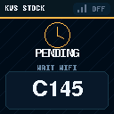
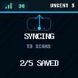
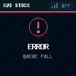
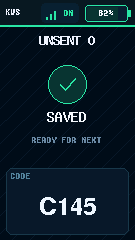
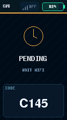
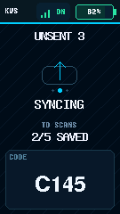
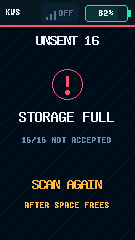

# M5Stack Inventory

M5Stack製品のSKUを表す2次元バーコードをUnit QRCodeで読み取り、AtomS3またはStickS3からWi-Fiで送ってGoogle Sheetsへ在庫履歴と現在庫を記録する個人向け在庫管理システムです。

> [!TIP]
> **初めて構築する方は、[図解付きの技術者向け構築・検証ガイド（PDF）](docs/M5Stack_Inventory_Guide.pdf)からご覧ください。**
> AtomS3 / StickS3のシステム構成と接続、Google Sheets / Apps Scriptの設定、DEVICE_KEYの作成、書込み、受入試験までを順番に説明しています。


本体側のボタンは使いません。Unit QRCodeのTRIGを押している間だけ読み取ります。`SAVED`は表示中の1件をScansへ保存確認済み、`ALL SAVED`は端末に未確認データが残っていないこと、`READY`は次を読み取れることを示します。`UNSENT n`は送信中も含む未確認件数です。通信できない間も最大16件を端末内へ保存し、復旧後に同じイベントIDで自動再送します。

## 主な機能

- M5Stack製品のSKUを表す2次元バーコードをUnit QRCodeの公式I2C APIで読み取り
- M5Unifiedで本体を制御し、M5GFXのSpriteを端末の画面サイズに合わせて一括描画
- 未送信数を常時表示し、READY、SCANNING、SAVED、SYNCING、ALL SAVED、STORAGE FULLなどで作業状況を案内
- 再送進捗は開始時の対象件数を固定して表示し、再送中の追加読取りも受け付け
- 読み取ったコードを視認性の高いFreeSansBold 12ptで表示
- HTTPS、共有キー、イベントIDによる認証と重複登録防止
- Scansに在庫履歴を保存し、Inventoryに保有数・状態・製品名・代表画像を表示
- 未使用、使用中、廃棄済みの状態管理
- M5Stack SKUの製品名・画像・公式ページをProductMasterへ補完
- 通常初期化と完全初期化
- AtomS3 / StickS3用の読取り確認環境と実運用環境
- 実ファームウェアの表示コードを使うPC画面キャプチャ生成

## 必要なもの

| 種別 | 内容 |
|---|---|
| 本体 | M5Stack AtomS3、またはStickS3 |
| リーダー | M5Stack Unit QRCode（SKU: U173） |
| 接続 | Groveケーブル、USB Type-Cケーブル |
| ネットワーク | 2.4 GHz Wi-Fi、インターネット接続 |
| Google | Google SheetsとApps Scriptを利用できるアカウント |
| 開発 | Visual Studio Code + PlatformIO。AtomS3はArduino IDE 2.x版も利用可能 |

## リポジトリ構成

| フォルダー | 内容 |
|---|---|
| `platformio/` | VS Code＋PlatformIO用ファームウェア |
| `arduino/M5Stack_Inventory/` | Arduino IDE 2.x用スケッチ |
| `apps-script/` | Google Sheetsへ配置するApps Script |
| `docs/` | 導入、運用、プロトコル、再現手順、PDFガイド |
| `tests/` | Apps Scriptのローカル試験 |
| `tools/` | Arduino版同期、配布ZIP、画面キャプチャ生成 |

## 導入手順

1. 電源を外し、Unit QRCodeをI2CモードにしてAtomS3またはStickS3のPORT.Aへ接続します。
2. [Google Sheets / Apps Scriptセットアップ](docs/apps-script-setup.md)に従い、スプレッドシートとWebアプリを準備します。
3. 開発環境を選びます。AtomS3は[Arduino IDE版スケッチ](arduino/M5Stack_Inventory/README.md)または下記のPlatformIO環境、StickS3はPlatformIO環境を使います。
4. 各手順に従って`secrets.h`を作成し、Wi-Fi、WebアプリURL、同じ`DEVICE_KEY`、信頼するルートCAを設定します。
5. Unit QRCodeのTRIGを押し続け、読取り音が鳴ったら離します。`SAVED`と対象コードを確認します。全件完了は`ALL SAVED`または`READY / UNSENT 0`で確認し、ScansとInventoryを別々に確認します。リーダー音だけでは受付成功を判断できません。

詳しい実機試験、状態変更、初期化は[セットアップと運用](docs/setup.md)を参照してください。

## PlatformIO環境

| 環境 | 用途 |
|---|---|
| `atoms3` | 読取りと表示だけを確認する安全な初期環境 |
| `atoms3-send-check` | Wi-Fi送信を有効にしたAtomS3実運用環境 |
| `atoms3-official-qrcode` | Unit QRCodeの公式サンプル相当の診断専用環境 |
| `sticks3` | StickS3の読取りと表示を確認する環境 |
| `sticks3-send-check` | Wi-Fi送信を有効にしたStickS3実運用環境 |

`official_qrcode_smoke.cpp`は診断環境だけで使います。通常版と送信版のビルドからは除外されています。

```sh
cd platformio
# AtomS3
pio run -e atoms3-send-check
# StickS3
pio run -e sticks3-send-check
```

StickS3では、Unit QRCodeの読取り、Wi-Fi接続、Apps Script経由のGoogle Sheets記録まで実機で確認済みです。

StickS3は給電後800ms待ってUnitの通常モードを確認し、ブートモード時だけ電源を切り替えず復帰命令を一度送ります。`READER RESUME`は確認中、`RECOVERY HOLD`は未確認のまま再送せず停止した状態です。本体Aボタンで再試行せず、[起動確認とエラー別の対処](docs/setup.md#sticks3の起動確認と切り分け)を参照してください。ブート復帰は実機未検証で、未送信イベントを保持します。

## Arduino IDE環境

Arduino IDE 2.x用のスケッチは[`arduino/M5Stack_Inventory`](arduino/M5Stack_Inventory/)にあります。GitHubからのダウンロード後、フォルダー内の`M5Stack_Inventory.ino`を開いて使えます。Arduino IDE版だけを配布する場合は[ZIP版](docs/downloads/M5Stack_Inventory_ArduinoIDE.zip)を使えます。

## Google Sheetsの構成

| シート | 役割 |
|---|---|
| Inventory | コード別の保有数、未使用、使用中、廃棄済み、製品情報、状態変更操作 |
| ProductMaster | コード、製品名、代表画像URL、参照元URL |
| Scans | すべての登録・状態変更イベントを保存し、Inventory集計の基になる履歴 |

Inventoryの数量セルやScansの既存行を直接変更すると、履歴と集計が一致しなくなります。日常の状態変更はInventoryの操作欄を使い、製品名や画像はProductMasterで修正します。


## 画面表示

PC上で実際の`InventoryDisplay.h`をM5GFXのSDLバックエンドへ渡し、説明書用の画面を生成できます。描画を別に作り直す方式ではないため、色、座標、フォント、文言はファームウェアと同じです。

| READY | SCANNING | STORED | SENDING | SAVED |
|---|---|---|---|---|
|  |  |  |  |  |

| 通信待ち | 再送進捗 | 全件完了 | 容量満杯 |
|---|---|---|---|
|  |  |  |  |

上の画面例はAtomS3です。StickS3は右上のWi-Fi表示の右に電池残量を表示します。次の82%はシミュレーターの例で、実機ではM5Unifiedから残量を取得します。取得できない場合は`--%`を表示します。

| StickS3 READY | StickS3 SAVED | StickS3 STORED / WAIT WIFI |
|---|---|---|
|  |  |  |

| StickS3 再送進捗 | StickS3 全件完了 | StickS3 容量満杯 |
|---|---|---|
|  |  |  |

StickS3の画面構成は[技術者向け構築・検証ガイド（PDF）](docs/M5Stack_Inventory_Guide.pdf)の22ページ、起動確認とブート復帰は23ページにも掲載しています。

`2/5 SAVED`は今回の再送対象5件のうち2件を確認済みという意味です。再送中の新しい読取りは分母へ追加せず、全体の`UNSENT`に即時反映します。AtomS3は再送進捗とコードの表示を切り替え、StickS3はコードと進捗を同時に表示します。新しい読取りの表示を優先します。

最大16件には送信中の1件も含みます。`STORAGE FULL / 16/16`では今回の読取りを受け付けていません。空きができてから再スキャンしてください。端末内保存に失敗した場合は`LOCAL STORAGE`を表示し、保存済みと扱いません。未確認データは電源再投入後も保持し、古い順に再送します。`SAVED`はScansへの保存確認であり、Inventoryの表示や製品名・画像の更新完了とは別です。

手順は[画面キャプチャ生成](tools/display-simulator/README.md)を参照してください。

## 謝辞と第三者ライセンス

本プロジェクトの端末制御と画面描画には、M5Stackの
[M5Unified](https://github.com/m5stack/M5Unified)と
[M5GFX](https://github.com/m5stack/M5GFX)を使用しています。
M5GFXの基盤となったグラフィックスライブラリ
[LovyanGFX](https://github.com/lovyan03/LovyanGFX)を開発・公開されている
[lovyan03氏](https://github.com/lovyan03)と、各ライブラリの開発者・貢献者に感謝します。

使用ライブラリ、フォント、ライセンス条件は
[第三者ソフトウェアに関する表記](THIRD_PARTY_NOTICES.md)を参照してください。

## テスト

Apps Scriptの受信、読戻し照合、重複防止、製品補完、状態遷移、初期化をローカルの模擬Sheets環境で確認します。端末の保存応答、永続FIFO、再送進捗もC++17コンパイラーを使う合成試験で確認します。

```sh
node --test tests/ingest.test.cjs
python3 tools/display-simulator/tests/run_tests.py
```

実機とGoogle側を含む受入条件は[受入試験](docs/reproduction-checklist.md)にあります。

## セキュリティ

- `secrets.h`、`.env`、`.clasp.json`はGitへ登録しません。
- Google Sheetsは非公開のまま使います。Webアプリの公開口は共有キーで保護します。
- `DEVICE_KEY`は32文字以上が必須です。本資料では32バイトの暗号学的乱数を16進数化した64文字を使い、漏えい時はGoogle側と端末側の両方を交換します。
- TLS証明書検証を無効化しません。
- WebアプリのGETは死活情報だけを返し、在庫データを返しません。

製品写真を含む第三者素材には、本プロジェクトのMIT Licenseは適用されません。
画像の出典と確認状況は[ハードウェア画像の出典](docs/assets/hardware/SOURCES.md)を参照してください。

## ドキュメント

- [Google Sheets / Apps Scriptセットアップ](docs/apps-script-setup.md)
- [Arduino IDE版の導入と書き込み](arduino/M5Stack_Inventory/README.md)
- [セットアップと運用](docs/setup.md)
- [受信プロトコル](docs/protocol.md)
- [技術者向け再現チェックリスト](docs/reproduction-checklist.md)
- [技術者向け構築・検証ガイド（PDF）](docs/M5Stack_Inventory_Guide.pdf)
- [技術者向け構築・検証ガイド（Canva取込み用PPTX）](docs/M5Stack_Inventory_Guide.pptx)
- [第三者ソフトウェアに関する表記](THIRD_PARTY_NOTICES.md)

## License

本プロジェクトが独自に作成したソースコードとドキュメントは、[MIT License](LICENSE)で提供します。
第三者ライブラリ、フォント、製品写真には、それぞれの権利者が定める条件が適用されます。
