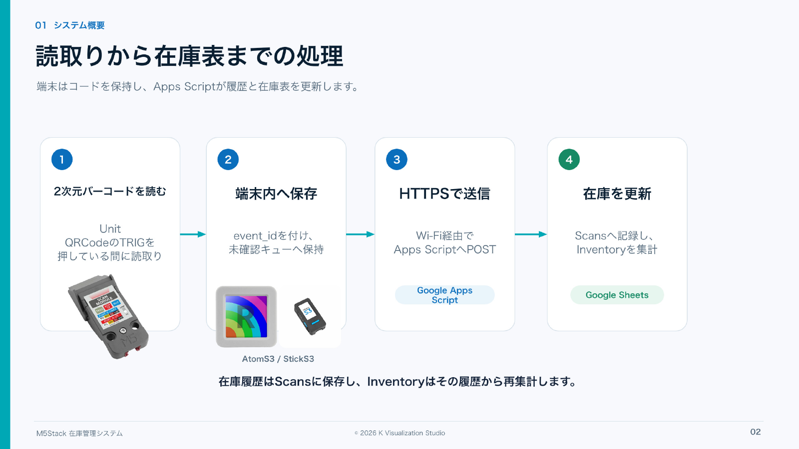
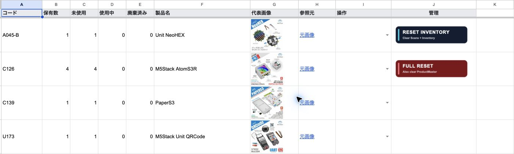
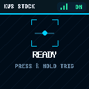
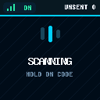
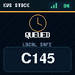
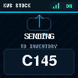
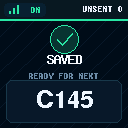

# M5Stack Inventory

Unit QRCodeで読み取ったコードをAtomS3からWi-Fiで送り、Google Sheetsへ在庫履歴と現在庫を記録する個人向け在庫管理システムです。



AtomS3のボタンAは使いません。Unit QRCodeのTRIGを押している間だけ読み取り、端末が`SAVED / READY FOR NEXT`を表示した時点で、Apps ScriptがScansへの保存を読み戻して確認済みです。通信できない間は最大16件を端末内へ保存し、同じイベントIDで自動再送します。

## 主な機能

- QRコード・バーコードをUnit QRCodeの公式I2C APIで読み取り
- M5Unifiedで本体を制御し、M5GFXのSpriteで128×128画面を一括描画
- READY、SCANNING、QUEUED、SENDING、SAVED、PENDING、NO CODE、QUEUE FULLを表示
- 読み取ったコードを視認性の高いFreeSansBold 12ptで表示
- HTTPS、共有キー、イベントIDによる認証と重複登録防止
- Scansを履歴の正本として、Inventoryに保有数・状態・製品名・代表画像を表示
- 未使用、使用中、廃棄済みの状態管理
- M5Stack SKUの製品名・画像・公式ページをProductMasterへ補完
- 通常初期化と完全初期化
- AtomS3用実装とStickS3移行用ビルド環境
- 実ファームウェアの表示コードを使うPC画面キャプチャ生成

## 必要なもの

| 種別 | 内容 |
|---|---|
| 本体 | M5Stack AtomS3 |
| リーダー | M5Stack Unit QRCode（SKU: U173） |
| 接続 | Groveケーブル、USB Type-Cケーブル |
| ネットワーク | 2.4 GHz Wi-Fi、インターネット接続 |
| Google | Google SheetsとApps Scriptを利用できるアカウント |
| 開発 | Arduino IDE 2.x、またはVisual Studio Code + PlatformIO |

## リポジトリ構成

| フォルダー | 内容 |
|---|---|
| `platformio/` | VS Code＋PlatformIO用ファームウェア |
| `arduino/M5Stack_Inventory/` | Arduino IDE 2.x用スケッチ |
| `apps-script/` | Google Sheetsへ配置するApps Script |
| `docs/` | 導入、運用、プロトコル、再現手順、PDFガイド |
| `tests/` | Apps Scriptのローカル試験 |
| `tools/` | Arduino版同期、配布ZIP、画面キャプチャ生成 |

## 導入手順

1. 電源を外し、Unit QRCodeをI2CモードにしてAtomS3のPORT.Aへ接続します。
2. [Google Sheets / Apps Scriptセットアップ](docs/apps-script-setup.md)に従い、スプレッドシートとWebアプリを準備します。
3. 開発環境を選びます。Arduino IDEは[Arduino IDE版スケッチ](arduino/M5Stack_Inventory/README.md)、VS Codeは下記のPlatformIO環境を使います。
4. 各手順に従って`secrets.h`を作成し、Wi-Fi、WebアプリURL、同じ`DEVICE_KEY`、信頼するルートCAを設定します。
5. Unit QRCodeのTRIGを押し続け、読取り音が鳴ったら離します。`SAVED / READY FOR NEXT`を確認し、ScansとInventoryを確認します。

詳しい実機試験、状態変更、初期化は[セットアップと運用](docs/setup.md)を参照してください。

## PlatformIO環境

| 環境 | 用途 |
|---|---|
| `atoms3` | 読取りと表示だけを確認する安全な初期環境 |
| `atoms3-send-check` | Wi-Fi送信を有効にしたAtomS3実運用環境 |
| `atoms3-official-qrcode` | Unit QRCodeの公式サンプル相当の診断専用環境 |
| `sticks3` | 将来のStickS3移行用コンパイル環境 |

`official_qrcode_smoke.cpp`は診断環境だけで使います。通常版と送信版のビルドからは除外されています。

```sh
cd platformio
pio run -e atoms3-send-check
```

## Arduino IDE環境

Arduino IDE 2.x用のスケッチは[`arduino/M5Stack_Inventory`](arduino/M5Stack_Inventory/)にあります。GitHubからのダウンロード後、フォルダー内の`M5Stack_Inventory.ino`を開いて使えます。

## Google Sheetsの構成

| シート | 役割 |
|---|---|
| Inventory | コード別の保有数、未使用、使用中、廃棄済み、製品情報、状態変更操作 |
| ProductMaster | コード、製品名、代表画像URL、参照元URL |
| Scans | すべての登録・状態変更イベント。集計の正本 |

Inventoryの数量セルやScansの既存行を直接変更すると、履歴と集計が一致しなくなります。日常の状態変更はInventoryの操作欄を使い、製品名や画像はProductMasterで修正します。



## 画面表示

PC上で実際の`InventoryDisplay.h`をM5GFXのSDLバックエンドへ渡し、説明書用の画面を生成できます。描画を別に作り直す方式ではないため、色、座標、フォント、文言はファームウェアと同じです。

| READY | SCANNING | QUEUED | SENDING | SAVED |
|---|---|---|---|---|
|  |  |  |  |  |

手順は[画面キャプチャ生成](tools/display-simulator/README.md)を参照してください。

## 謝辞と第三者ライセンス

本プロジェクトの端末制御と画面描画には、M5Stackの
[M5Unified](https://github.com/m5stack/M5Unified)と
[M5GFX](https://github.com/m5stack/M5GFX)を使用しています。
M5GFXの基盤となったグラフィックスライブラリ
[LovyanGFX](https://github.com/lovyan03/LovyanGFX)を開発・公開されている
[lovyan03氏](https://github.com/lovyan03)と、各ライブラリの開発者・貢献者に感謝します。

使用ライブラリ、フォント、ライセンス条件は
[第三者ソフトウェアに関する表記](THIRD_PARTY_NOTICES.md)を参照してください。

## テスト

Apps Scriptの受信、重複防止、製品補完、状態遷移、初期化をローカルの模擬Sheets環境で確認します。

```sh
node --test tests/ingest.test.cjs
```

## セキュリティ

- `secrets.h`、`.env`、`.clasp.json`はGitへ登録しません。
- Google Sheetsは非公開のまま使います。Webアプリの公開口は共有キーで保護します。
- `DEVICE_KEY`は32文字以上が必須です。本資料では32バイトの暗号学的乱数を16進数化した64文字を使い、漏えい時はGoogle側と端末側の両方を交換します。
- TLS証明書検証を無効化しません。
- WebアプリのGETは死活情報だけを返し、在庫データを返しません。

公開前に、製品写真を含む第三者素材の再配布条件と、このリポジトリへ適用するライセンスを決定してください。

## ドキュメント

- [Google Sheets / Apps Scriptセットアップ](docs/apps-script-setup.md)
- [Arduino IDE版の導入と書き込み](arduino/M5Stack_Inventory/README.md)
- [セットアップと運用](docs/setup.md)
- [受信プロトコル](docs/protocol.md)
- [技術者向け再現チェックリスト](docs/reproduction-checklist.md)
- [技術者向け構築・検証ガイド（PDF）](docs/M5Stack_Inventory_Guide.pdf)
- [第三者ソフトウェアに関する表記](THIRD_PARTY_NOTICES.md)

このリポジトリにはライセンスをまだ設定していません。一般公開する前に、公開ライセンスの選択と製品写真の再配布可否を確認してください。
