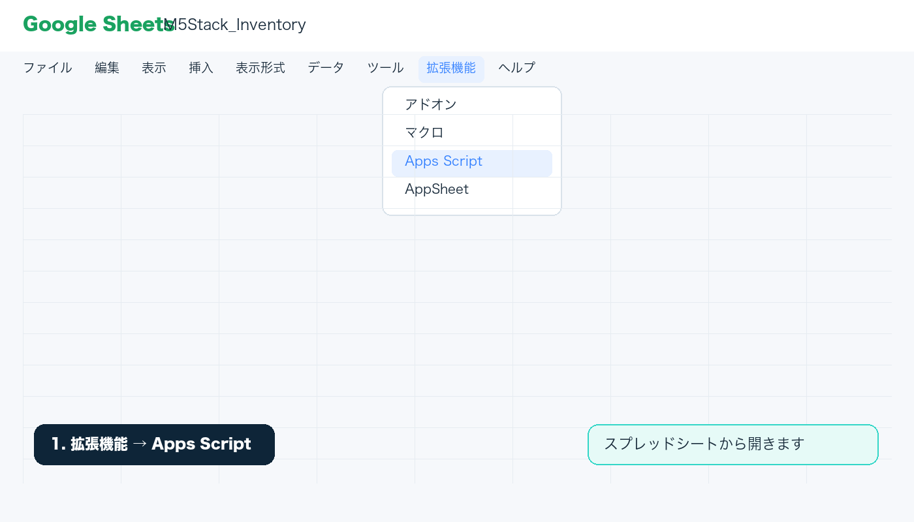
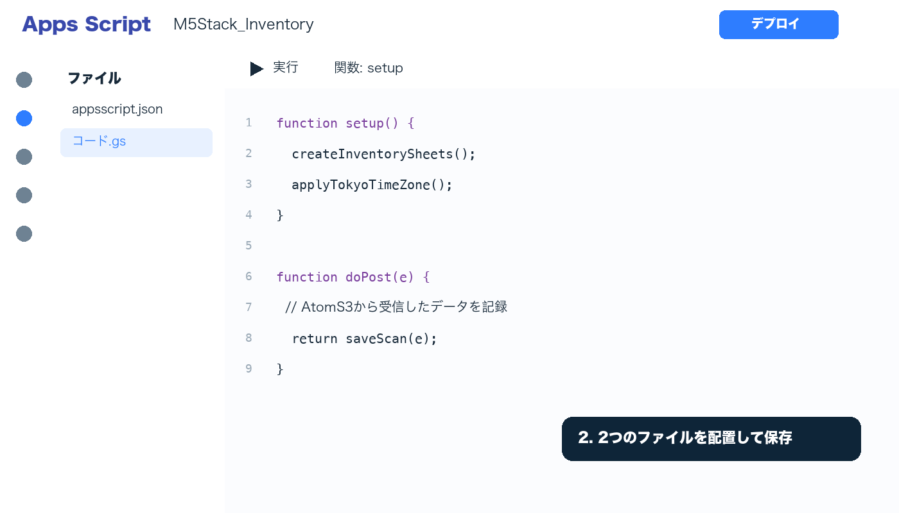
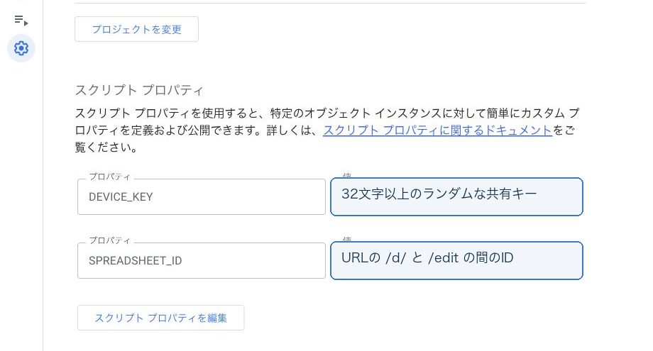
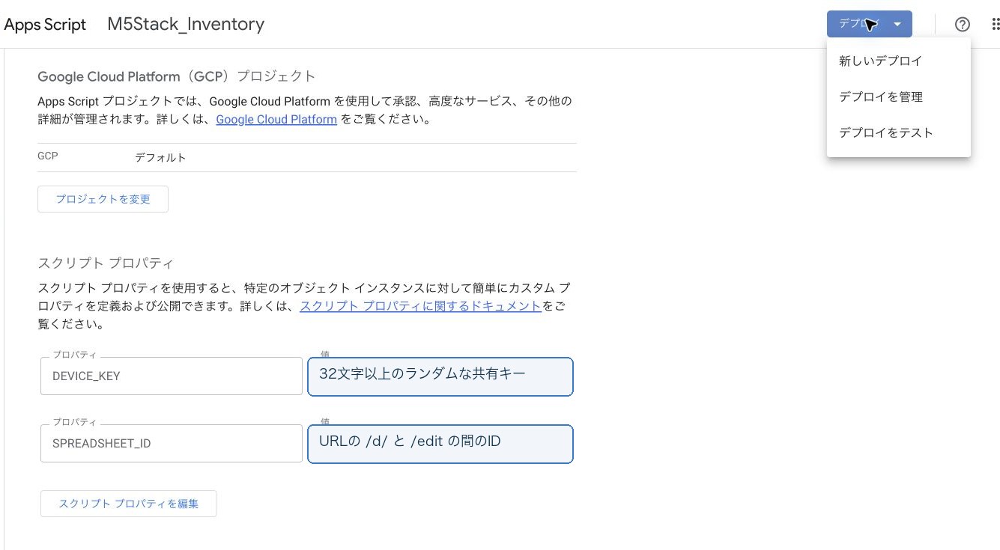
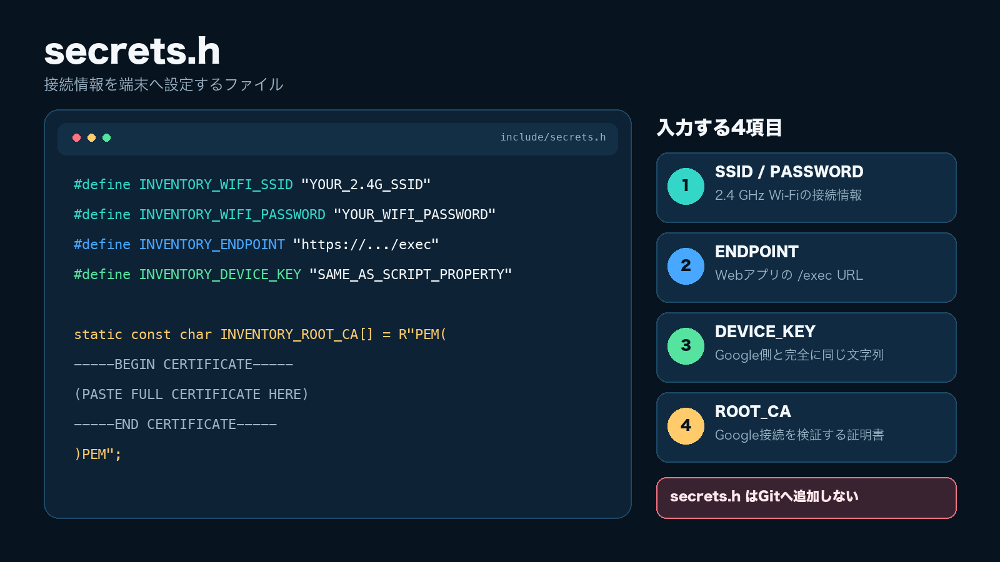

# Google Sheets / Apps Scriptセットアップ

この手順では、Google Sheetsを非公開の在庫台帳として作成し、AtomS3またはStickS3から受信するApps Script Webアプリを設定します。秘密値はApps Scriptのスクリプトプロパティと端末の`secrets.h`だけに保存します。

## 0. 前提とファイル配置

この手順は、次の構成を前提にしています。作業前にリポジトリを取得し、ルートフォルダーから相対パスが一致することを確認してください。

| 用途 | ファイル |
|---|---|
| AtomS3 / StickS3ファームウェア | `platformio/` |
| PlatformIO設定 | `platformio/platformio.ini` |
| 端末設定のひな形 | `platformio/include/secrets.example.h` |
| Arduino IDE版 | `arduino/M5Stack_Inventory/` |
| Apps Script本体 | `apps-script/Code.gs` |
| Apps Scriptマニフェスト | `apps-script/appsscript.json` |
| 受信プロトコル | `docs/protocol.md` |

ファームウェアの主要バージョンは`platformio.ini`へ固定されています。AtomS3は`atoms3`と`atoms3-send-check`、StickS3は`sticks3`と`sticks3-send-check`を使い、後者がWi-Fi送信を有効にした実運用環境です。

## 1. スプレッドシートを作る

1. 在庫管理に使うGoogleアカウントで新しいGoogle Sheetsを作成します。
2. ファイル名は任意です。例として`M5Stack_Inventory`を使用します。
3. スプレッドシートURLを確認します。

```text
https://docs.google.com/spreadsheets/d/SPREADSHEET_ID/edit
```

`/d/`と`/edit`の間が`SPREADSHEET_ID`です。ファイル名やシート名ではありません。

## 2. Apps Scriptへコードを配置する

1. スプレッドシートの`拡張機能`から`Apps Script`を開きます。



2. プロジェクト名を分かりやすい名前に変更します。例：`M5Stack_Inventory`。
3. エディタにあるコードファイルへ`apps-script/Code.gs`の全内容を貼り付け、保存します。Googleの画面でファイル名が`コード.gs`と表示されても問題ありません。



4. Apps Scriptのプロジェクト設定でマニフェストファイルを表示し、`apps-script/appsscript.json`の内容を反映して保存します。

`appsscript.json`にはスプレッドシート操作とM5Stack公式ページ取得に必要な権限、V8ランタイム、タイムゾーンが含まれます。

## 3. スクリプトプロパティを設定する

Apps Script左側の歯車`プロジェクトの設定`を開き、`スクリプト プロパティ`で2件追加します。



| プロパティ | 値 |
|---|---|
| `SPREADSHEET_ID` | 手順1で確認したID |
| `DEVICE_KEY` | 32文字以上のランダムな共有キー |

DEVICE_KEYは32バイトの暗号学的乱数を16進数へ変換した64文字を推奨します。OSに合う手順を使用してください。表示された値はチャット、README、動画、Gitへ貼り付けないでください。

### macOS / Linux

OpenSSLが利用できるターミナルで実行します。

```sh
openssl rand -hex 32
```

### Windows 10 / 11

Windows標準のWindows PowerShell 5.1で実行できます。OpenSSLの追加インストールは不要です。次の5行をまとめて貼り付け、最後に表示される64文字を使用します。この手順はPowerShell 7でも動作します。

```powershell
$bytes = New-Object byte[] 32
$rng = [System.Security.Cryptography.RandomNumberGenerator]::Create()
$rng.GetBytes($bytes)
-join ($bytes | ForEach-Object { $_.ToString("x2") })
$rng.Dispose()
```

どちらの方法でも出力は`0-9`と`a-f`だけで構成された64文字です。文字数や文字種が違う場合は、値を手で修正せず再生成します。Web上のランダム文字列生成サイトは、秘密値が外部へ送信される可能性があるため使用しません。

同じ`DEVICE_KEY`を後で端末側の`INVENTORY_DEVICE_KEY`にも設定します。Google側と端末側の値が1文字でも違うと`UNAUTHORIZED`になります。

## 4. 初期セットアップを実行する

1. Apps Scriptエディタ上部の関数選択で`setup`を選びます。
2. `実行`を押します。
3. 初回だけGoogleアカウントの権限確認が表示されます。対象のスプレッドシートと外部接続の内容を確認して許可します。
4. 実行ログが`実行完了`になることを確認します。
5. Sheetsへ戻り、次の3シートと見出しを確認します。

| シート | 主な見出し |
|---|---|
| Inventory | コード、保有数、未使用、使用中、廃棄済み、製品名、代表画像、参照元、操作 |
| ProductMaster | コード、製品名、画像URL、参照元URL |
| Scans | event_id、code、delta、received_at、状態差分、action |

スプレッドシートのタイムゾーンと日時表示は`Asia/Tokyo`、`yyyy/MM/dd HH:mm:ss`に設定されます。既存データがある場合、`setup()`は対応する列構成へ移行します。想定外の列構成は上書きせず停止します。

## 5. Webアプリとしてデプロイする

1. Apps Script右上の`デプロイ`から`新しいデプロイ`を選びます。
2. 種類で`ウェブアプリ`を選びます。
3. `次のユーザーとして実行`は`自分`を選びます。
4. `アクセスできるユーザー`は`全員`を選びます。
5. デプロイし、表示された`/exec`で終わるWebアプリURLを安全な場所へ控えます。



組織のGoogle Workspaceポリシーで匿名アクセスを許可できない場合、この端末構成のままでは利用できません。管理者ポリシーを確認するか、別の受信方式を設計してください。

ブラウザで`/exec` URLを開くと、次のような死活応答だけが表示されます。InventoryやScansの内容は返しません。

```json
{"ok":true,"service":"inventory-ingest","version":1}
```

コードを変更した場合は、`デプロイを管理`で既存デプロイを編集し、新しいバージョンを選んで更新します。既存デプロイを更新すれば通常は同じ`/exec` URLを継続できます。エディタで保存しただけでは公開中のWebアプリへ反映されません。

## 6. 端末へ接続情報を設定する

1. PlatformIOでは`platformio/include/secrets.example.h`を同じフォルダーの`secrets.h`へコピーします。Arduino IDEでは`arduino/M5Stack_Inventory/secrets.example.h`を同じスケッチフォルダーの`secrets.h`へコピーします。
2. 次の値を設定します。

```cpp
#define INVENTORY_WIFI_SSID "2.4 GHz Wi-FiのSSID"
#define INVENTORY_WIFI_PASSWORD "Wi-Fiパスワード"
#define INVENTORY_ENDPOINT "https://script.google.com/macros/s/.../exec"
#define INVENTORY_DEVICE_KEY "Apps Scriptと同じDEVICE_KEY"
```

3. `script.google.com`と`script.googleusercontent.com`を検証できる現在有効なルートCAを`INVENTORY_ROOT_CA`へ設定します。確認方法は次項に示します。
4. PlatformIOはAtomS3なら`atoms3-send-check`、StickS3なら`sticks3-send-check`を選びます。Arduino IDE版は`M5AtomS3`ボードと`USB CDC On Boot: Enabled`を選び、AtomS3へ書き込みます。Arduino IDE側のボードパッケージとライブラリのバージョンは[Arduino IDE手順](../arduino/M5Stack_Inventory/README.md)に固定値を記載しています。



`secrets.h`は`.gitignore`の対象です。証明書検証を無効化する`setInsecure()`は使用しません。

### 6.1 ルートCAの確認と更新

TLS証明書チェーンは将来変更される可能性があります。資料に古い証明書を固定して配布せず、設定時に両ホストのチェーンを確認します。

```sh
openssl s_client -connect script.google.com:443 -servername script.google.com -showcerts </dev/null
openssl s_client -connect script.googleusercontent.com:443 -servername script.googleusercontent.com -showcerts </dev/null
```

出力されたサーバー証明書をそのまま信頼アンカーにしないでください。Issuerをたどり、OSの信頼済みCAストア、または[Google Trust Servicesの公式リポジトリ](https://pki.goog/repository/)で該当するルートCAの名称、有効期限、SHA-256フィンガープリントを照合します。必要なルート証明書をPEM形式で`INVENTORY_ROOT_CA`へ連結し、`BEGIN CERTIFICATE`から`END CERTIFICATE`までを含めます。

ビルド後はシリアルログでTLS接続成功を確認します。証明書期限切れ、Issuer変更、Google側のチェーン変更があった場合は、同じ手順で再確認してファームウェアを更新します。

### 6.2 PlatformIOでのビルド、書込み、ログ確認

PlatformIO Coreを利用できるターミナルで実行します。VS CodeのPlatformIOボタンを使う場合も、選択する環境は同じです。

接続している機種に対応する一方だけを実行します。

AtomS3:

```sh
cd platformio
pio run -e atoms3-send-check
pio run -e atoms3-send-check -t upload
pio device monitor -b 115200
```

StickS3:

```sh
cd platformio
pio run -e sticks3-send-check
pio run -e sticks3-send-check -t upload
pio device monitor -b 115200
```

初回は対象シリアルポートを確認し、複数デバイスが接続されている場合はPlatformIOの`upload_port`または`--upload-port`で明示します。

### 6.3 Arduino IDEでのビルド、書込み、ログ確認

1. `arduino/M5Stack_Inventory/M5Stack_Inventory.ino`をArduino IDE 2.xで開きます。
2. `ツール` → `ボード` で`M5AtomS3`を選び、`USB CDC On Boot`を`Enabled`にします。
3. AtomS3のポートを選び、`検証・コンパイル`の後に`マイコンボードに書き込む`を実行します。
4. シリアルモニタを115200 bpsで開き、Unit QRCodeの初期化、Wi-Fi接続、送信結果を確認します。

詳細は[Arduino IDE版の導入と書き込み](../arduino/M5Stack_Inventory/README.md)を参照してください。

## 7. 最初の1件を確認する

1. 端末の上部表示がWi-Fi `ON`、中央が`READY`になるまで待ちます。
2. Unit QRCodeのTRIGを押したままコードへ向けます。
3. 読取り音が鳴ったらTRIGを離します。
4. `QUEUED`、`SENDING`、`SAVED / READY FOR NEXT`の順に進むことを確認します。
5. Google SheetsのScansへ1行、Inventoryへ対象製品が追加されることを確認します。

`SAVED`はApps ScriptがScansへ書き込み、同じ`event_id`と`code`を読み戻して`verified:true`を返した状態です。Google Sheetsをブラウザで開いていなくてもWebアプリは動作し、データは追加されます。

## 8. よくある問題

| 症状 | 確認すること |
|---|---|
| `UNAUTHORIZED` | Google側と`secrets.h`の`DEVICE_KEY`が完全一致しているか |
| `NOT_CONFIGURED` | `SPREADSHEET_ID`と`DEVICE_KEY`をスクリプトプロパティへ保存したか |
| 変更が反映されない | 保存後に既存Webアプリを新しいバージョンへ更新したか |
| Inventoryに製品情報がない | ProductMasterのB〜D列、公式SKUページ、画像URLを確認 |
| 画像だけ表示されない | 画像URLが直接取得できるHTTPS URLか、外部画像アクセスを許可したか |
| 日時がJSTでない | `setup()`を再実行し、スプレッドシートのタイムゾーンを確認 |
| `PENDING`が続く | Wi-Fi、TLS用CA、WebアプリURL、Apps Script実行履歴を確認 |
| Apps Scriptが302/303を返す | 端末実装はGoogleの転送先へGETし、共有キー付きPOSTを転送しない |

## 9. 再現確認

公開や実運用の前に、実在庫とは分けたテスト用スプレッドシートで確認します。

```sh
node --test tests/ingest.test.cjs
cd platformio
pio run -e atoms3 -e atoms3-send-check -e sticks3 -e sticks3-send-check
```

実機では次の順に確認します。

1. 未登録コードを1回送信し、Scansが1行、Inventoryの保有数が1になる。
2. 同じ`event_id`を再送し、Scansと保有数が増えない。
3. 新しい`event_id`で同じコードを送信し、保有数が2になる。
4. Wi-Fiを切った状態で読み取り、`PENDING`または未送信キューへ保持される。
5. Wi-Fi復旧後に`SAVED`となり、1回だけ追加される。
6. Sheetsをブラウザで閉じた状態でも、Webアプリ経由で追加される。
7. M5Stack以外のコードや公式検索に失敗したコードは、ProductMasterのB〜D列を手動補完できる。

本実装は個人の少量データを対象としています。重複確認はScansの履歴全体を参照するため、大量履歴の性能は未検証です。StickS3はUnit QRCodeの読取り、Wi-Fi接続、Google Sheetsへの実送信を実機確認済みです。画面レイアウトは使用する端末で最終確認してください。Google Workspaceの匿名Webアプリ公開、Apps ScriptやSheetsのクォータも導入先で確認してください。

## 更新・キー交換

- Apps Scriptを更新したら、既存Webアプリの新しいバージョンとして再デプロイします。
- `DEVICE_KEY`を交換する場合は、Google側と端末側の両方へ同じ新しい値を設定します。
- キーをソース管理へ入れた場合は、その値を削除するだけでなく新しい値へ交換します。
- 初期化前は端末の未送信キューが空であることを確認し、必要ならSheetsをダウンロードしてバックアップします。

## 公式資料

- [Google Apps Script Web Apps](https://developers.google.com/apps-script/guides/web)
- [Google Apps Script Content Service](https://developers.google.com/apps-script/guides/content)
- [M5Stack Unit QRCode](https://docs.m5stack.com/en/unit/Unit-QRCode)
- [M5Stack AtomS3](https://docs.m5stack.com/en/core/AtomS3)
